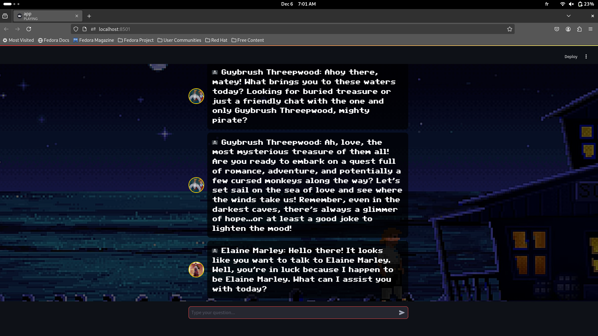

# Monkey Island Chatbot

Welcome to the Monkey Island Chatbot! This Streamlit app allows users to interact with various characters from the Monkey Island series, including Guybrush Threepwood, LeChuck, and Elaine Marley. The characters respond in their unique tones, making your experience fun and immersive.

  

## Features

- **Character Interaction**: Chat with characters from the Monkey Island universe, including Guybrush Threepwood, LeChuck, and Elaine Marley.
- **Dynamic Backgrounds**: Switch between different backgrounds, such as "Grog Shop" and "Treasure Island".
- **Easter Egg**: A special button allows you to switch to an ocean view and play ocean sounds, promoting water conservation.
- **Audio**: Background music and sound effects enhance the immersive experience.
- **Character Icons**: Each character has their own unique icon, displayed alongside their responses.
- **Custom Font**: The app uses a custom font styled after the LucasArts SCUMM games for an authentic feel.

## Requirements

To run the app, you will need the following libraries:

- `streamlit`
- `openai`
- `base64`
- `random`
- `logging`

You can install the required libraries with the following command:

```bash
pip install streamlit openai


